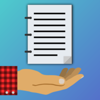

# Aplikacja frontendowa do projektu "Note Dealer"



##### Zespół numer 2, 
##### Programowanie Zespołowe 2021/2022

***

## Spis treści
* [Opis projektu](#opis-projektu)
  * [W skrócie](#w-skrócie)
  * [Opis funkcjonalności](#opis-funkcjonalności)
* [Technologie](#technologie)
  * [Frameworki](#frameworki)
  * [Wykorzystywane biblioteki](#wykorzystywane-biblioteki)
* [Architektura aplikacji](#architektura-aplikacji)
  * [Diagram aplikacji](#diagram-aplikacji)
  * [Diagram wdrożenia aplikacji](#diagram-wdrożenia-aplikacji)
* [Przykładowe fragmenty kodu aplikacji](#przykadowe-fragmenty-kodu-aplikacji)
  * [Komponent navbar](#komponent-navbar)
  * [Komponent Button](#komponent-button)
  * [Implementacja React Navigation](#implementacja-react-navigation)
  * [Implementacja Redux](#implementacja-redux)
* [Poradnik programisty](#poradnik-programisty)
  * [Uruchomienie aplikacji w trybie deweloperskim](#uruchomienie-aplikacji-w-trybie-deweloperskim)
  * [Stworzenie builda produkcyjnego](#stworzenie-builda-produkcyjnego) 
***
## Opis projektu
### W skrócie
Jest to aplikacja mobilna, pozwalająca użytkownikom na sprzedawanie i kupowanie notatek.
Przeznaczona jest głównie na Androida, ale działa również na iOS. 

### Opis funkcjonalności

Użytkownik rejestruje się przy użyciu adresu imienia, nazwiska, e-maila i hasła.
Następnie może dodać notatkę z możliwością przesłania do 14 zdjęć lub wyszukać po tytule notatkę w celu kupienia jej.
Po zakupie użytkownik może pobrać pliki notatki oraz zamieścić ocenę.
W aplikacji możliwe jest również zgłaszanie notatek, które są niewłaściwe oraz zgłaszanie błędów aplikacji. 
Wszystkie tego typu zgłoszenia są do odczytu dla administratorów w bazie danych.
W przypadku gdy inny użytkownik kupi stworzoną przez nas notatkę, to wysyłanie jest powiadomienie push informujące nas o tym.

***

## Technologie

Aplikacja została napisana w języku JavaScript.

### Frameworki

Do stworzenia aplikacji mobilnej wykorzystano technologie:

* [React Native](https://reactnative.dev)
* [Expo](https://expo.dev)


### Wykorzystywane biblioteki

W tworzeniu aplikacji pomogło użycie gotowych paczek:

* [React Redux](https://react-redux.js.org)
* [React Navigation](https://reactnavigation.org)
* [react-native-neomorph-shadows](https://github.com/tokkozhin/react-native-neomorph-shadows)
* [react-native-input-outline](https://github.com/swushi/react-native-input-outline)
* [react-native-image-viewing](https://github.com/jobtoday/react-native-image-viewing)
* [react-native-flash-message](https://github.com/lucasferreira/react-native-flash-message)
* [react-native-bouncy-checkbox](https://github.com/WrathChaos/react-native-bouncy-checkbox)
* [react-native-picker](https://github.com/react-native-picker/picker)

oraz komponentów z pakietu Expo, między innymi:
* [expo/vector-icons](https://github.com/expo/vector-icons)
* [expo-image-picker](https://docs.expo.dev/versions/latest/sdk/imagepicker/)
* [expo-file-system](https://docs.expo.dev/versions/latest/sdk/filesystem/)
* [expo-notifications](https://docs.expo.dev/versions/latest/sdk/notifications/)

***

## Architektura aplikacji

### Diagram aplikacji


Przedstawiony diagram został stworzony na etapie projektowania aplikacji, nie jest w pełni zgodny z efektem końcowym.

### Diagram wdrożenia aplikacji


Aplikacja na urządzeniu użytkownika wysyła zapytania zapytania na serwer RESTowy hostowany na Heroku. 
Następnie serwer pobiera dane z bazy danych MondoDB znajdującej się w chmurze, a odpowiedź zwraca na fronend.
Dodatkowo, backend łączy się z usługą Firebase, znajdującą się w chmurze, w celu przetworzenia powiadomień push, które wysyłane są do urządzenia użytkownika.

***

## Przykładowe fragmenty kodu aplikacji

### Komponent navbar

```javascript
//...

const NavbarComponent = (props) => {
    const [buttonDisplay1, setButtonDisplay1] = useState(false);
    const [buttonDisplay2, setButtonDisplay2] = useState(false);
    const [buttonDisplay3, setButtonDisplay3] = useState(false);

    const onPressHandler1 = () => {
        buttonDisplay1 ? setButtonDisplay1(false) : setButtonDisplay1(true);
    };
    const onPressHandler2 = () => {
        buttonDisplay2 ? setButtonDisplay2(false) : setButtonDisplay2(true);
    };
    const onPressHandler3 = () => {
        buttonDisplay3 ? setButtonDisplay3(false) : setButtonDisplay3(true);
    };

    let homeBoxDisplay = function () {
        if (props.homeButtonActive)
            return (
                <NeomorphBox inner swapShadowLevel style={styles.navbar_bg_inner}>
                    <TouchableOpacity activeOpacity={1} style={styles.button}>
                        <Image
                            source={navbar_home_button_active}
                            style={styles.navbar_home_button}
                        />
                    </TouchableOpacity>
                </NeomorphBox>
            );
        else
            return (
                <NeomorphBox
                    inner
                    swapShadowLevel
                    style={buttonDisplay1 ? styles.navbar_bg_inner : styles.navbar_bg_inner_hidden}
                >
                    <TouchableOpacity
                        activeOpacity={1}
                        style={styles.button}
                        onPressIn={() => onPressHandler1()}
                        onPressOut={() => onPressHandler1()}
                        onPress={() => props.navigation.navigate('Home')}
                    >
                        <Image
                            source={buttonDisplay1 ? navbar_home_button_active : navbar_home_button}
                            style={styles.navbar_home_button}
                        />
                    </TouchableOpacity>
                </NeomorphBox>
            );
    };

    let searchBoxDisplay = function () {
        if (props.searchButtonActive)
            return (
                <NeomorphBox inner swapShadowLevel style={styles.navbar_bg_inner}>
                    <TouchableOpacity activeOpacity={1} style={styles.button}>
                        <Image
                            source={navbar_search_button_active}
                            style={styles.navbar_search_button}
                        />
                    </TouchableOpacity>
                </NeomorphBox>
            );
        else
            return (
                <NeomorphBox
                    inner
                    swapShadowLevel
                    style={buttonDisplay2 ? styles.navbar_bg_inner : styles.navbar_bg_inner_hidden}
                >
                    <TouchableOpacity
                        activeOpacity={1}
                        style={styles.button}
                        onPressIn={() => onPressHandler2()}
                        onPressOut={() => onPressHandler2()}
                        onPress={() => props.navigation.navigate('Search')}
                    >
                        <Image
                            source={
                                buttonDisplay2 ? navbar_search_button_active : navbar_search_button
                            }
                            style={styles.navbar_search_button}
                        />
                    </TouchableOpacity>
                </NeomorphBox>
            );
    };

    let addBoxDisplay = function () {
        if (props.addButtonActive)
            return (
                <NeomorphBox inner swapShadowLevel style={styles.navbar_bg_inner}>
                    <TouchableOpacity activeOpacity={1} style={styles.button}>
                        <Image source={navbar_add_button_active} style={styles.navbar_add_button} />
                    </TouchableOpacity>
                </NeomorphBox>
            );
        else
            return (
                <NeomorphBox
                    inner
                    swapShadowLevel
                    style={buttonDisplay3 ? styles.navbar_bg_inner : styles.navbar_bg_inner_hidden}
                >
                    <TouchableOpacity
                        activeOpacity={1}
                        style={styles.button}
                        onPressIn={() => onPressHandler3()}
                        onPressOut={() => onPressHandler3()}
                        onPress={() => props.navigation.navigate('Add')}
                    >
                        <Image
                            source={buttonDisplay3 ? navbar_add_button_active : navbar_add_button}
                            style={styles.navbar_add_button}
                        />
                    </TouchableOpacity>
                </NeomorphBox>
            );
    };

    return (
        <>
            <Image id="navbar" source={require('../assets/navbar.png')} style={styles.navbar} />
            <View style={styles.navbarPos}>
                <NeomorphBox
                    lightShadowColor="#ffb3b5"
                    darkShadowColor="#ff4d72"
                    style={styles.navbar_home_button_bg}
                >
                    {homeBoxDisplay()}
                </NeomorphBox>

                <NeomorphBox
                    lightShadowColor="#ffb3b5"
                    darkShadowColor="#ff4d72"
                    style={styles.navbar_search_button_bg}
                >
                    {searchBoxDisplay()}
                </NeomorphBox>

                <NeomorphBox
                    lightShadowColor="#ffb3b5"
                    darkShadowColor="#ff4d72"
                    style={styles.navbar_add_button_bg}
                >
                    {addBoxDisplay()}
                </NeomorphBox>
            </View>
        </>
    );
};
export default NavbarComponent;

```

Przedstawiony komponent odpowiada za wyświetlanie dolnego paska nawigacji. 
W zależności od ekranu, w którym znajduje się użytkownik, komponent podświetla daną ikonkę.

### Komponent Button

```javascript
//...

const ButtonComponent = (props) => {
    return(
    <NeomorphBox style={styles.neu}>
        <NeomorphBox
            inner
            lightShadowColor="#b3fffd"
            darkShadowColor="#13d8d5"
            style={styles.neuAcceptInner_hidden}
        >
            <TouchableOpacity
                activeOpacity={0.75}
                style={styles.button}
                onPress={props.onPress}
                disabled={props.disabled}
            >
                <Text style={styles.text0}>{props.title}</Text>
            </TouchableOpacity>
        </NeomorphBox>
    </NeomorphBox>
    )
}

export default ButtonComponent;

```

Przedstawiony komponent odpowiada za wyświetlanie i obsługę standardowego przycisku w naszej aplikacji. 
NeomorphBox jest to gotowy komponent, odpowiada on za tworzenie cieni w stylu Neumorphism.

### Implementacja React Navigation

```javascript
import React from 'react';
import { createDrawerNavigator } from '@react-navigation/drawer';
import { DrawerContent } from '../views/DrawerContent';
import { StackNavigator } from './StackNavigators';

const Drawer = createDrawerNavigator();

const DrawerNavigator = () => (
    <Drawer.Navigator
        initialRouteName="StackNavigator"
        drawerContent={(props) => <DrawerContent {...props} />}
    >
        <Drawer.Screen
            name="StackNavigator"
            component={StackNavigator}
            options={{
                headerShown: false,
                drawerItemStyle: { display: 'none' },
                swipeEnabled: false
            }}
        />
    </Drawer.Navigator>
);

export default DrawerNavigator;

```
Fragment kodu przedstawia implementację React Navigation. 
Jest tutaj tworzony DrawerNavigator, który umoźliwia stworzenie wysuwanego paska bocznego.
Zawiera on w sobie StackNavigator, w którym dodane są wszystkie ekrany aplikacji oraz umożliwia on poruszanie się do przodu i cofanie w aplikacji.

### Implementacja Redux

```javascript
import { configureStore } from '@reduxjs/toolkit';
import noteIdReducer from './noteIdSlice';
import userDataReducer from './userSlice';
import userAvatarReducer from './userAvatarSlice';
import commentDataReducer from './commentSlice';
import searchReducer from './searchSlice';

export default configureStore({
    reducer: {
        noteId: noteIdReducer,
        userData: userDataReducer,
        userAvatar: userAvatarReducer,
        commentData: commentDataReducer,
        search: searchReducer
    }
});

```

Przedstawiony fragment kodu to "store.js", jest to główny plik Reduxa.
Importowane są do niego slice'y, czyli pliki przechowujące stany wraz z ich reducer'ami

```javascript
import { createSlice } from '@reduxjs/toolkit';

export const userSlice = createSlice({
    name: 'userData',
    initialState: {
        _id: '',
        nickname: '',
        name: '',
        surname: '',
        email: '',
        major: '',
        school: '',
        rating: ''
    },
    reducers: {
        setUserData: (state, data) => {
            state._id = data.payload._id;
            state.name = data.payload.name;
            state.surname = data.payload.surname;
            state.email = data.payload.email;
            state.major = data.payload.major;
            state.school = data.payload.school;
            state.nickname = data.payload.nickname;
            state.rating = data.payload.rating;
        },
        setNickname: (state, data) => {
            state.nickname = data.payload;
        },
        setUserSchool: (state, data) => {
            console.log(data);
            state.school = data.payload;
        },
        setUserMajor: (state, data) => {
            console.log(data);
            state.major = data.payload;
        }
    }
});

export const { setUserData, setNickname, setUserSchool, setUserMajor } = userSlice.actions;

export default userSlice.reducer;

```

Powyższy fragment kodu to slice zawierający dane użytkownika.
Przechowujemy je w tym miejscu, aby uniknąć wielokrotnego ich ładowania po zmianie danych w profilu.

## Poradnik programisty

### Uruchomienie aplikacji w trybie deweloperskim

`npm start`

Poprzez aplikację Expo na smartfonie skanujemy QR code i następnie możemy korzystać z aplikacji lub
uruchamiamy aplikację poprzez emulator androida/iOS na komputerze

### Stworzenie builda produkcyjnego

`eas login`

`eas build:configure`

Aby stworzyć apk:
`eas build -p android --profile preview`

Aby stworzyć abb: 
`eas build -p android`

